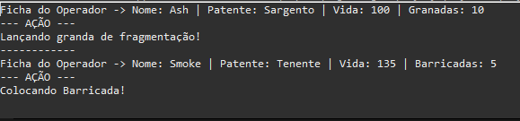

# 🎖️ Esquadrão Tático: Explorando os Fundamentos do POO com Java

[](https://www.java.com/)
[]()
[]()

## 🕹️ Sobre o Projeto

Bem-vindo(a) ao **Esquadrão Tático**!  
Este repositório apresenta um sistema didático desenvolvido em **Java puro**, focado em praticar — de forma clara e aplicada — os pilares fundamentais da **Programação Orientada a Objetos (POO)**. Inspirado em jogos de FPS, o projeto simula a criação e execução de diferentes tipos de operadores táticos dentro de um esquadrão especial.

> 💡 **Finalidade:** Consolidar conceitos essenciais da POO de maneira prática e facilitar a compreensão para estudantes e candidatos a vagas de estágio back-end que desejam fortalecer seu portfólio.

---

## 🏆 O Que Foi Aprendido

Confira a aplicação dos pilares de POO neste projeto:

| Pilar                    | Onde foi aplicado                                                                                              |
|--------------------------|---------------------------------------------------------------------------------------------------------------|
| **Encapsulamento**       | Atributos privados em `Operador` (`nome`, `vida`, `patente`, `qtdGranadas`, `qtdBarricadas`) e acesso via getters/setters (incluindo validação de vida) |
| **Sobrecarga de Construtores** | Múltiplos construtores na classe `Operador` (vida padrão e customizada)                              |
| **Herança**              | Criação das classes-filhas `Atacante` e `Defensor` (herdando de `Operador`)                                   |
| **super**                | Uso do `super` para delegar parte da construção entre pai e filho                                             |
| **Polimorfismo**         | Método `usarHabilidade()` sobrescrito nas subclasses, possibilitando ações únicas para cada tipo de operador   |
| **Sobrescrita (`@Override`)** | Implementação customizada de `toString()` (exibe ficha detalhada do operador)                     |

---

## 🗂️ Estrutura do Projeto

```
Operadores/
├── src/
│   ├── Operador.java          # Classe base com atributos e comportamentos genéricos
│   ├── Atacante.java          # Especialização de operador focada em ataque
│   ├── Defensor.java          # Especialização voltada à defesa
│   ├── Partida.java           # Classe principal para execução e testes do sistema
│   └── img/
│       └── exemplo-terminal.png # Imagem do resultado no terminal
```

---

## 🖥️ Demonstração (Saída de Exemplo)

Confira abaixo o resultado de execução — diretamente do terminal — exibindo operadores em ação:



---

## 🚀 Como Executar

Siga estes passos simples para compilar e testar:

1. **Clone o repositório**  
   ```bash
   git clone https://github.com/VINICIUS0098876/Operadores.git
   cd Operadores
   ```

2. **Abra na sua IDE Java favorita** (Ex: IntelliJ IDEA, Eclipse, VS Code...)

3. **Compile e execute a classe de entrada (`Partida`)**  
   - Se preferir usar o terminal:
     ```bash
     cd src
     javac *.java
     java Partida
     ```

---

## ✨ Diferenciais Didáticos

- **Código organizado profissionalmente** e comentado para facilitar o estudo.
- Ênfase em boas práticas e recursos essenciais de orientação a objetos.
- Simulação lúdica e temática, tornando o aprendizado mais envolvente! 🎯🪖

---

## 📚 Indicações Finais

Se você busca se destacar em processos seletivos ou fortalecer sua base no back-end, este projeto é referência para demonstrar domínio de POO em Java.

---
